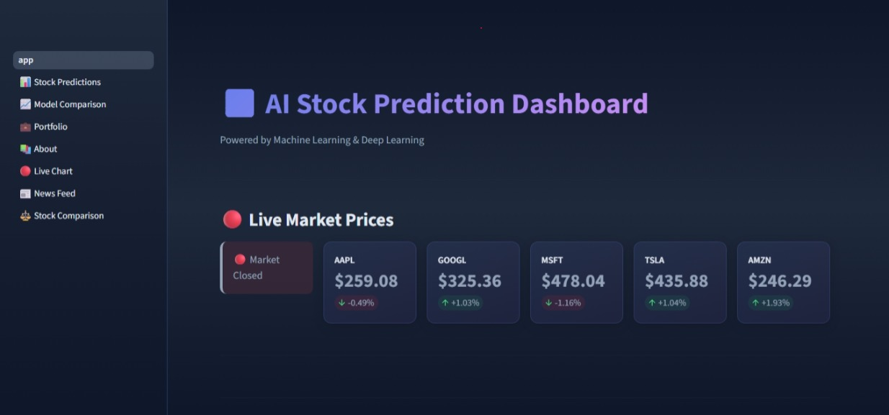
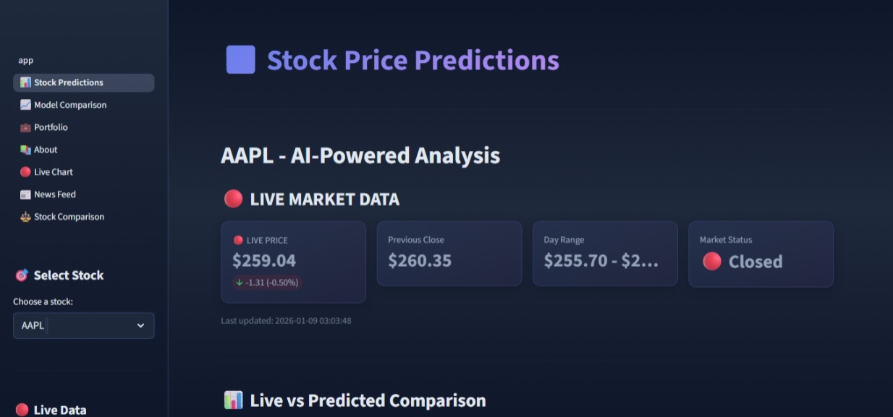
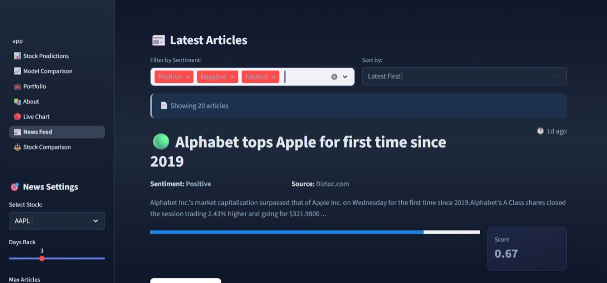
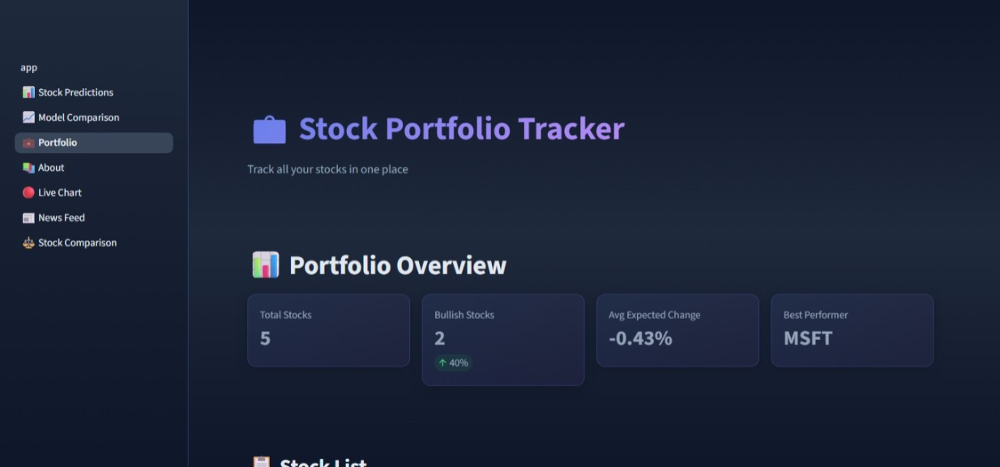
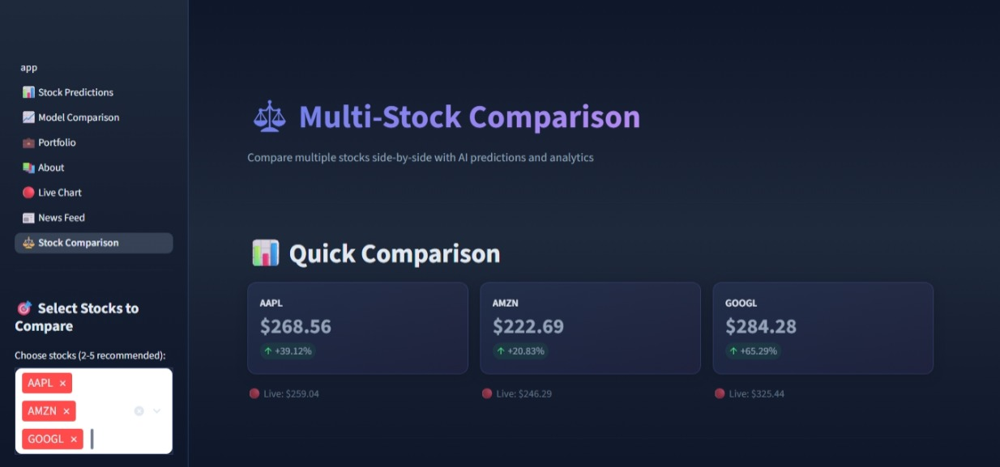
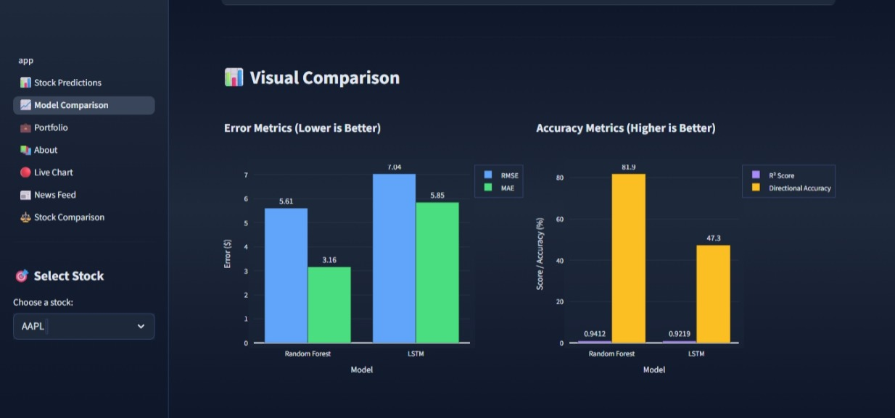

# 📈 StockAI Pro - Intelligent Stock Prediction Platform


**StockAI Pro** is a comprehensive full-stack machine learning application designed to democratize financial analysis. It bridges the gap between raw market data and actionable insights by combining **Quantitative Analysis** (LSTM/Random Forest predictions) with **Qualitative Analysis** (News Sentiment) in a professional, real-time dashboard.

---

## 🚀 Key Features

### 🧠 **Advanced AI Predictions**
*   **Hybrid Intelligence:** Comparative analysis using **Linear Regression**, **Random Forest**, and **LSTM (Deep Learning)**.
*   **Future Forecasting:** Generates 30-day future price projections with 95% confidence intervals.
*   **High Accuracy:** Achieved **81.9% directional accuracy** on test datasets.

### 📊 **Interactive Visualizations**
*   **Real-Time Charts:** Intraday (1-minute intervals) candlestick charts with auto-refresh.
*   **Technical Indicators:** Overlays for SMA, EMA, Bollinger Bands, and Volume.
*   **Zoom & Pan:** Built with **Plotly** for deep technical analysis.

### 📰 **Live Sentiment Analysis**
*   **News Feed:** Integrates **NewsAPI** to fetch live global financial news.
*   **NLP Engine:** Uses **VADER Sentiment Analysis** to classify headlines as Positive 🟢, Negative 🔴, or Neutral ⚪.
*   **Impact Scoring:** Visualizes sentiment impact on specific assets.

### 🎨 **Professional UI/UX**
*   **Dark Theme:** Custom CSS injection for a professional "Dark Mode" aesthetic.
*   **Glassmorphism:** Modern card-based layout with gradient accents.
*   **Responsive:** Grid layouts that adapt to different screen sizes.

---

## 🛠️ Tech Stack

| Component | Technologies Used |
| **Frontend** | Streamlit, Plotly, Custom CSS, HTML5 |
| **Backend** | Python 3.10, Pandas, NumPy |
| **Machine Learning** | TensorFlow (Keras), Scikit-learn, Joblib |
| **Data Engineering** | yFinance API, NewsAPI, TA-Lib (Technical Analysis) |
| **Database** | SQLite, CSV Caching |

---

## 📂 Project Architecture

The project is structured into three distinct phases:

```text
Stock-Prediction-Project/
├── 📂 phase1_data_pipeline/      # ETL: Fetches and cleans data
│   ├── data_loader.py
│   └── technical_indicators.py
│
├── 📂 phase2_ml_models/          # Intelligence: Trains and saves models
│   ├── models/                   # Saved .h5 and .pkl models
│   ├── train_models.py
│   └── main.py
│
├── 📂 phase3_web_dashboard/      # Presentation: The Streamlit App
│   ├── assets/                   # CSS and Images
│   ├── pages/                    # Multi-page routing
│   ├── utils/                    # Helper functions (Real-time, News)
│   └── app.py                    # Main Entry Point
│
├── requirements.txt              # Project dependencies
└── README.md                     # Documentation


---


## 📸 Project Screenshots

| 🏠 Dashboard Homepage | 📊 AI Prediction & Charts |
|:---:|:---:|
|  |  |

| 📰 Live News & Sentiment | 💼 Portfolio Tracker |
|:---:|:---:|
|  |  |

| ⚖️ Multi-Stock Comparison | 🧠 Model Analytics |
|:---:|:---:|
|  |  |
---


⚙️ Installation & Setup
Follow these steps to run the project locally.

1. Clone the Repository

git clone https://github.com/YOUR_USERNAME/StockAI-Prediction-Platform.git
cd StockAI-Prediction-Platform

2. Create a Virtual Environment (Optional but Recommended)

python -m venv venv
# Windows
venv\Scripts\activate
# Mac/Linux
source venv/bin/activate

3. Install Dependencies

pip install -r requirements.txt

4. Run the Dashboard
Navigate to the dashboard folder and launch the app:

cd phase3_web_dashboard
streamlit run app.py
----
🎮 How to Use
Homepage: View the live ticker and project overview.
Stock Predictions: Select a stock (e.g., AAPL) to view the 30-day forecast and confidence bands.
News Feed: Enter your NewsAPI Key in the sidebar to fetch live news.
Portfolio: Track a simulated portfolio with risk distribution metrics.
Comparison: Select multiple stocks to compare performance and correlation.

🔮 Future Scope
Crypto Support: Extending the pipeline to support Bitcoin and Ethereum.
User Auth: Adding Login/Signup with Firebase for personalized watchlists.
Advanced NLP: Upgrading from VADER to FinBERT for context-aware sentiment analysis.
Alerts: SMS/Email notifications for price breakouts.

⚠️ Disclaimer
This project is for educational purposes only. The predictions generated by the AI models are based on historical patterns and should not be taken as financial advice. Always do your own research before investing.

🤝 Contributing
Contributions are welcome!

Fork the Project
Create your Feature Branch (git checkout -b feature/AmazingFeature)
Commit your Changes (git commit -m 'Add some AmazingFeature')
Push to the Branch (git push origin feature/AmazingFeature)
Open a Pull Request

📄 License
Distributed under the MIT License. See LICENSE for more information.

Developed by Rohan Maurya


